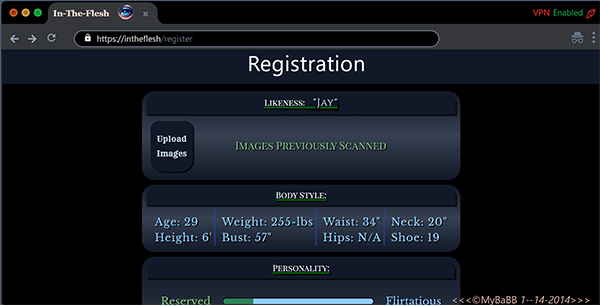

THIS IS LIKE AN AUDITION FOR A MOVIE WEBSITE. (Unfinished)
I THOUGH THAT I HAD THIS JOB. ITS INCOMPLETE AND WAS JUST A DEMO FOR THE MOVIE.
THEY CUT THIS FROM THE SCRIPT. BUT HERE IT IS AND IT WAS FUN. \*_IT IS ALL FAKE. Dark Web Fake Page_

not finished but at least I got to turn in something to Hollywood. Now they have my number.

This is the In the flesh demo for the Movies It represents a person typing on a mac pc and I will automate it per the following script.

xxxxxxxxxxxxxxxxxxxxxxxxxxxxxxxxxxxxxxxxxxxxxxxxxxxxxxxxxx
Non functional demo for the movie. But I made it responsive.
xxxxxxxxxxxxxxxxxxxxxxxxxxxxxxxxxxxxxxxxxxxxxxxxxxxxxxxxxx

Hey Brett, thanks for the reply.
I'm attaching the script pages that describe the webpage. I think it's pretty straightforward -- we were thinking it would look like the Terminal program on Mac. There is slight animation with the "welcome back" that fades away, but otherwise it should all be one page.
If you're still interested after reading, let me know and we can discuss timeline and what you might charge for something this? Thanks!

" I will have to watch some Dark web videos on youtube to see what the terminal looks like on mac.
I will never access the dark web. I am just making a demo for the movie." 1-12-2024 BB.

He types “InTheFlesh.com” into the search browser and hits
“ENTER.”
He is taken to an all-black screen with nothing but boxes for
a USERNAME and PASSWORD. He types “ThisIsTheCarter” into the
username and then a line of asterisks for his password.
His log-in credentials are accepted - the words “WELCOME
BACK” fade onto the screen before disappearing. He is then
taken to another cryptic page, also with a black background,
that looks similar to the “settings” page on someone’s social
media account.
The top section is labeled LIKENESS and there is a button for
images to be uploaded - next to that button is the text
“IMAGES PREVIOUSLY SCANNED” in green text, showing that Jay
has already uploaded the necessary photos.
Jay scrolls down...
There are sections for Height, Weight, and standard fitting
dimensions - Bust, Waist, Hips.
Everything has already been filled out with precise
dimensions that are obviously not Jay’s own.
Jay scrolls down further...
There are a number PERSONALITY SLIDERS.

One has “RESERVED” on the left side and “FLIRTATIOUS” on the
right side - the slider is about 80% of the way towards
“FLIRTATIOUS.”
One has “EMOTIONALLY CLOSED” on one side and “EMOTIONALLY
OPEN” on the other, slider is 70% towards “OPEN.”
“EXTRAVERSION” / “INTROVERSION” - 95% extraverted.
“SENSING” / “INTUITION” - 75% sensing. More “FEELING” than
“THINKING.” More “PERCEIVING” than “JUDGING.”
Almost all the way towards “PASSIVE” versus “AGGRESSIVE.”
“MENTAL CONNECTION” and “SEXUAL CONNECTION” - 70% towards
“SEXUAL.”
“SECURE ATTACHMENT” and “AVOIDANT ATTACHMENT” - 80% towards
“SECURE.”
“SERIOUS” and “HUMOROUS” - the slider skews slightly towards
“SERIOUS.”
There are 10-20 of these sliders with other various
categories. Apathy and Empathy. Low Metacognition vs High.
There is also a section with a bunch of “INTERESTS” and a box
underneath with a search bar. Already-selected are “TODD
HAYNES FILMS,” “MADONNA,” “RIESLING,” and “VINTAGE SHOPPING”
among others.
Jay scrolls to the bottom of the page, where there is one
final section: “RELATIONSHIP HISTORY.” Next to this, it says
“DOCUMENTS PREVIOUSLY UPLOADED” in green text.
Underneath that, there is a BOX that is CHECKED - next to
this, it says, “REMEMBER PAST INTERACTIONS.”
And finally there is one button left, that says “CONFIRM
SESSION.” Jay CLICKS the final button.
The page goes DARK and a countdown CLOCK begins ticking where
all of the text used to be. 30 seconds... 29 seconds... 28
seconds...
Jay reaches for the CONTACT LENS CONTAINER that seems to be
charging in his laptop’s USB port and OPENS it.
He takes the CONTACTS out, one at a time, and places one in
each eye. You can faintly see some sort of COMPUTER CHIP
TECHNOLOGY on each lens. He blinks a few times before looking
back at the screen.
15 seconds... 14... 13...
Attached to the contact lens container is a section that
holds two BLACK EARBUDS - Jay places one in each ear.
5 seconds on the screen. Text appears below the countdown
that says “CLOSE YOUR EYES UNTIL YOU HEAR A VOICE.”
Jay closes his eyes and takes a deep breath. The clock
continues to tick towards zero.
3... 2... 1...

- [@vitejs/plugin-react](https://github.com/vitejs/vite-plugin-react/blob/main/packages/plugin-react/README.md) uses [Babel](https://babeljs.io/) for Fast Refresh
- [@vitejs/plugin-react-swc](https://github.com/vitejs/vite-plugin-react-swc) uses [SWC](https://swc.rs/) for Fast Refresh
